# 基于运放的滤波器设计

- [基于运放的滤波器设计](#基于运放的滤波器设计)
  - [滤波器基础理论和概念](#滤波器基础理论和概念)
    - [滤波器的基本参数](#滤波器的基本参数)
      - [幅频响应](#幅频响应)
      - [相频响应](#相频响应)
  - [ADI有源滤波器设计工具](#adi有源滤波器设计工具)
  - [运放通用滤波器PCB设计](#运放通用滤波器pcb设计)

## 滤波器基础理论和概念

滤波器是一种只允许一定频段内信号通过的电路。因此，按其滤波特性可以分为低通、高通、带通、带阻四种；如果按能量来源，则可以分为有源滤波器与无源滤波器。

本文讨论的是有源、基于运算放大器的模拟滤波器的设计与实现方法。实现步骤主要分为两个：一、使用ADI模拟滤波器设计工具进行滤波器设计，以确定阻容元器件的值；二、使用通用运放滤波器PCB实现滤波器，并且进行调试。

### 滤波器的基本参数

本小节基本参数的讨论以低通滤波器为例

#### 幅频响应

对于一个低通滤波器而言，我们想要达到的效果是“低频通过、高频阻断”。也就是说，其幅频响应曲线大致如下：

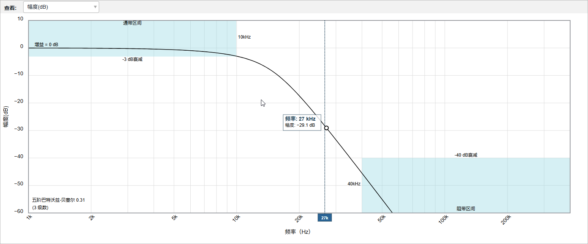

纵轴是响应幅度，横轴是频率。这个图表达了在每一个频率下，该滤波器对于输入信号的放大缩小的程度。一般认为，-3dB以上为通带，-40dB以下为阻带。

对于该低通滤波器而言，-3dB点在10kHz，-40dB点在40kHz。因此，我们就可以说，该低通滤波器对于小于10kHz的信号具有良好的可通过性（通带），对于大于40kHz的信号具有良好的阻断效果（阻带）。

那么，10kHz到40kHz之间就叫“过渡带”，在该区间内的信号按照滚降曲线所示的幅频特性进行衰减。

因此，我们可以得到描述一个滤波器的基本参数，也就是`通带频率`和`阻带频率`。这两个参数是设计滤波器最基本的参数。

#### 相频响应

一个IIR滤波器对于不同频率的信号会有不同程度的延迟，这表现在信号处理上就是输出频率与输入频率具有一定的相位差。

如果一个滤波器对于所有频率的信号都具有相同时间的延迟，则相位与频率的关系就是线性的（此处不做推导，详细请参考《信号与系统》课程内容），这个滤波器就成为线性相位滤波器。全部FIR滤波器都属于这个类型。

反之，一个滤波器对于不同的频率分量，延迟的时间不一样，那么就会出现相位响应非线性的问题。对于IIR滤波器而言，其响应曲线大致如下：

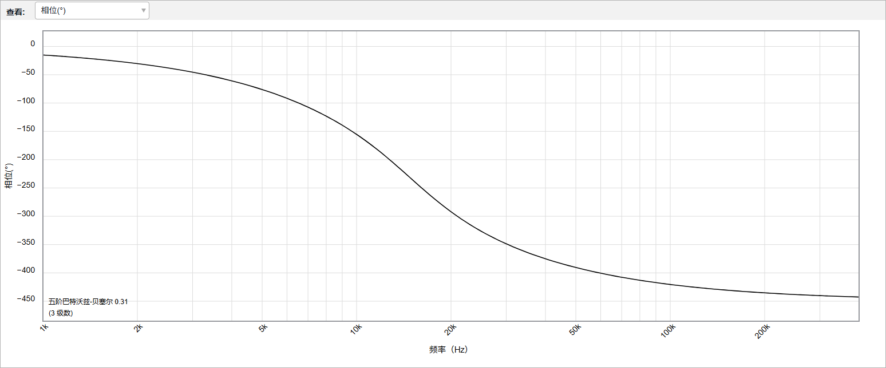

很明显，这个相位响应就是一条曲线。但是可以发现，这条曲线可以近似看作几条折线：

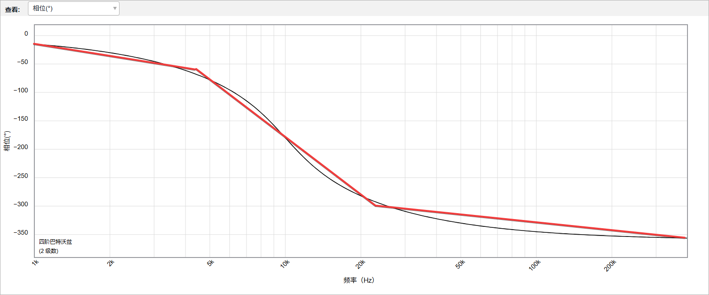

那么，我们就可以认为，在一定范围内，IIR滤波器也是具有近似线性相位响应的，只是肯定不如FIR那么线性罢了。

## ADI有源滤波器设计工具

ADI模拟设计在线工具集：

> https://tools.analog.com/cn/precisionstudio/

选择`模拟滤波器`，进入到如下界面：

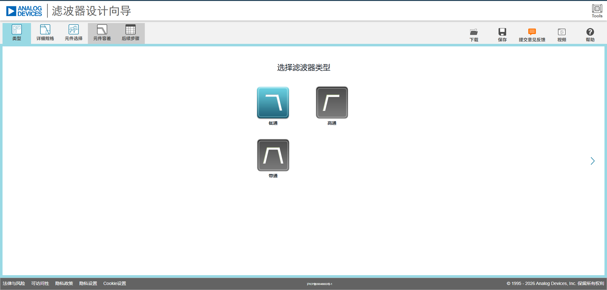

在这个界面中，可以看到主要的设计步骤分为`类型`、`详细规格`和`元件选择`。以一个低通滤波器为例，我们在`类型`页面选择`低通`：

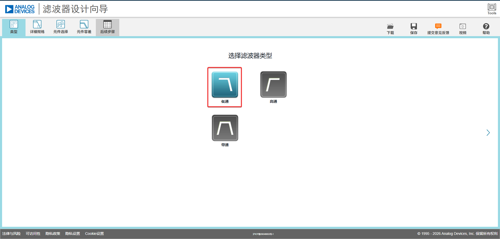

然后进入`详细规格`页面。在这里可以设置滤波器的通带和阻带，并且通过滑动`滤波器响应`中的滑动条选择滤波器的类型。我们需要注意的是`滤波器响应`一栏中的滤波器类型：

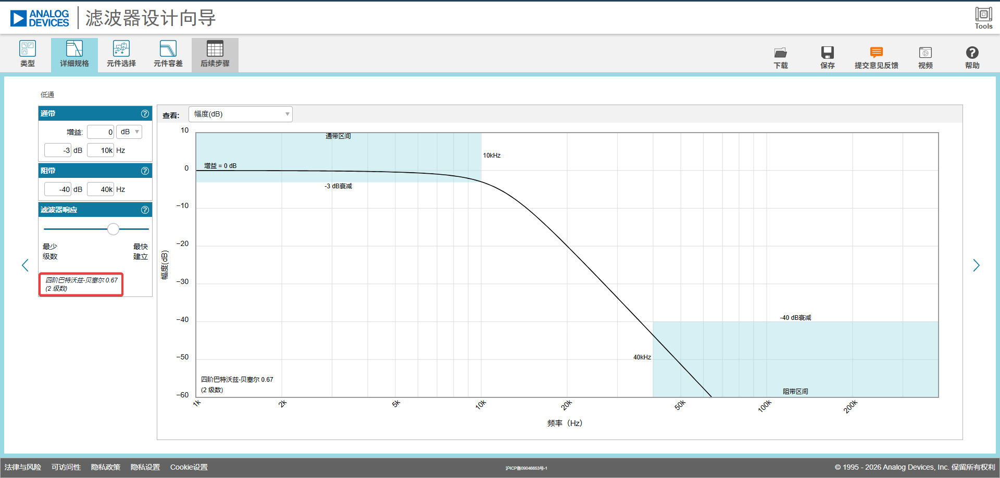

第一行是滤波器的类型，第二行是所要用到的运放的数量，“2级数”就是要用两个运放，“3级数”就是要用3个运放。一般来说一个运放代表了两阶滤波器。

完成响应设置之后，进入到`元件选择`就可以查看各个阻容元器件的计算值了：

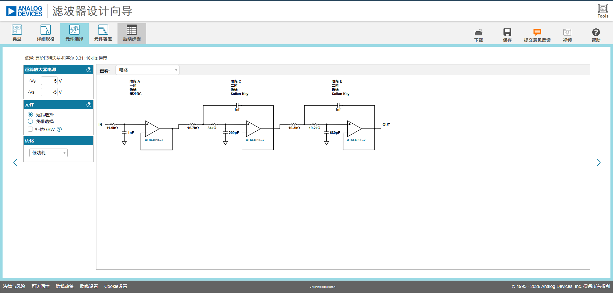

这个页面显示的就是滤波器的电路结构。我们可以很容易从中提取到一个二阶低通滤波器的通用结构如下：

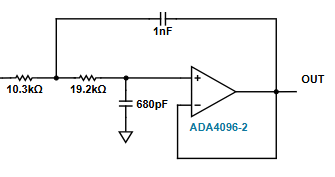

观察最左边的一阶滤波器，可以发现，一阶滤波器单元其实就是二阶滤波器单元的一部分（观察两个红框，电路结构是一样的）：

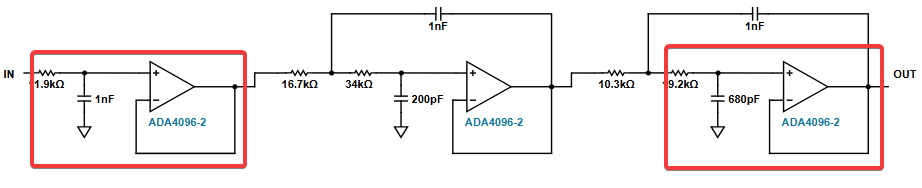

也就是说，我们可以将一个二阶滤波器单元提取出来做成PCB板子，这个板子可以兼容一阶滤波器单元，多个PCB板子串联起来可以实现ADI滤波器设计工具设计出来的所有阶数的滤波器。

## 运放通用滤波器PCB设计

核心的二阶滤波器单元原理图设计如下：

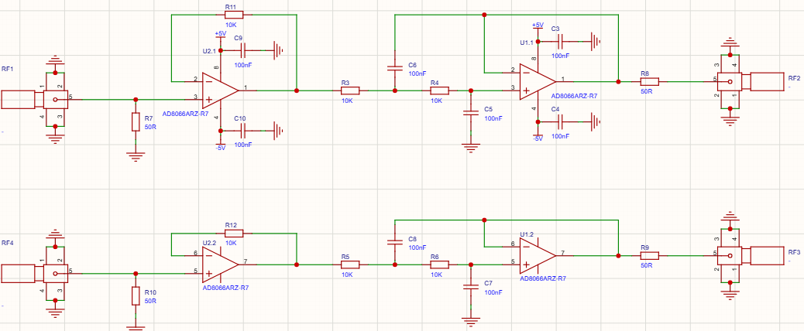

本设计使用两个双运放芯片，一个芯片用于实现跟随器，另一个芯片用于实现二阶滤波器单元。跟随器用于阻抗匹配.

值得注意的是，SMA输入端与GND并接一个50欧姆电阻、SMA输出端串接了一个50欧姆电阻，这两个电阻用于与长距离同轴线的阻抗匹配，如果是短距离应用或者低频应用，可以直接用一坨锡或者0欧电阻代替。

原理图设计中，供电与其他辅助部件如下：

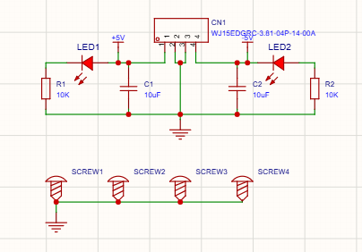

本设计采用双电源供电，并且配置有MLCC的滤波电容和LED指示灯，还设计了M3螺丝孔用于固定与堆叠。
