# STM32开源工具链

- [STM32开源工具链](#stm32开源工具链)
  - [系统安装](#系统安装)
    - [VMware虚拟机](#vmware虚拟机)
    - [Ubuntu-24.04安装](#ubuntu-2404安装)
  - [环境部署](#环境部署)
    - [需要下载的工具](#需要下载的工具)
      - [STM32CubeMX2（仅用于C5系列）](#stm32cubemx2仅用于c5系列)
      - [STM32CubeMX（不可用于C5系列）](#stm32cubemx不可用于c5系列)
      - [VS Code](#vs-code)
    - [安装方法](#安装方法)
      - [STM32CubeMX2（仅用于C5系列）](#stm32cubemx2仅用于c5系列-1)
      - [STM32CubeMX（不可用于C5系列）](#stm32cubemx不可用于c5系列-1)
      - [VS Code](#vs-code-1)
      - [GCC](#gcc)
      - [OpenOCD](#openocd)
    - [环境验证](#环境验证)


## 系统安装

### VMware虚拟机

需要安装Ubuntu-24.04虚拟机，VMware下载地址：

> https://www.vmware.com/products/desktop-hypervisor/workstation-and-fusion

VMware使用教程：

> https://zhuanlan.zhihu.com/p/110128514

### Ubuntu-24.04安装

Ubuntu-24.04下载地址：

> https://mirrors.ustc.edu.cn/

点击“获取安装镜像”：

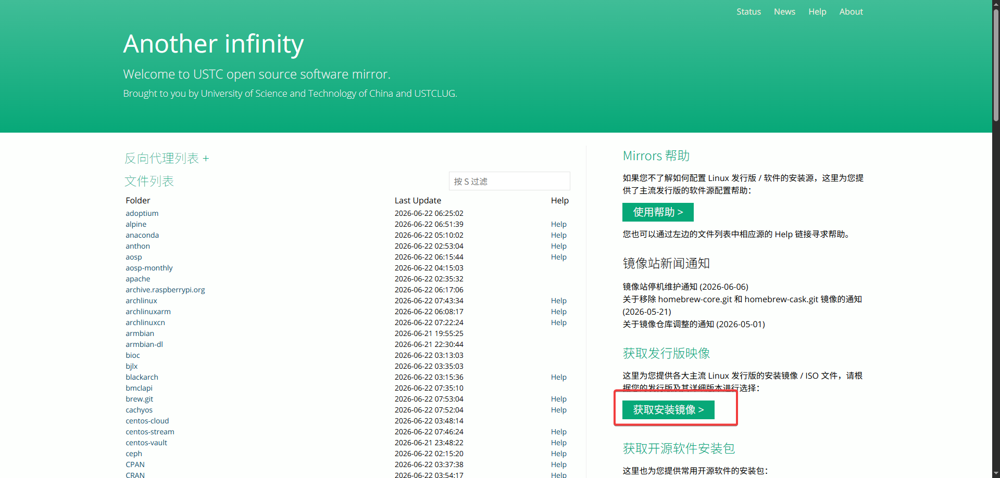

选择Ubuntu-24.04.4,注意**一定要选择amd64架构的desktop版本**。


Ubuntu-24.04安装教程：

> https://zhuanlan.zhihu.com/p/695298037

Ubuntu-24.04的基本操作:

> https://zhuanlan.zhihu.com/p/672688377

Linux基础操作：

> https://www.runoob.com/linux/linux-tutorial.html

## 环境部署

### 需要下载的工具

#### STM32CubeMX2（仅用于C5系列）

> https://www.st.com/en/development-tools/stm32cubemx.html

使用ST账号登录后选择STM32CubeMX2：

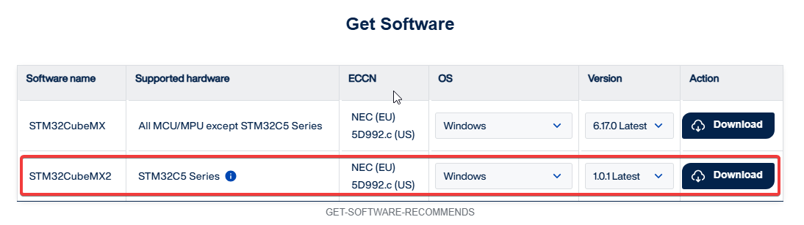

#### STM32CubeMX（不可用于C5系列）

> https://www.st.com/en/development-tools/stm32cubemx.html

使用ST账号登录后选择STM32CubeMX：


选择Linux版本：


#### VS Code

> https://code.visualstudio.com/Download?_exp_download=fb315fc982

选择deb下载：

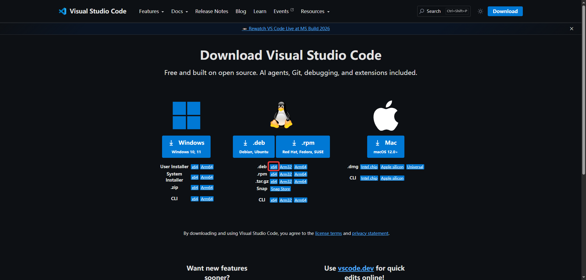

### 安装方法

#### STM32CubeMX2（仅用于C5系列）

首先安装基础库：

```Shell
sudo apt update
sudo apt install libwebkit2gtk-4.1-0
```

然后执行下载的文件：

```Shell
sudo ./stm32cubemx2-1.0.1-X64-Linux-installer
```

依次如下选择（全部保持默认选项即可）：


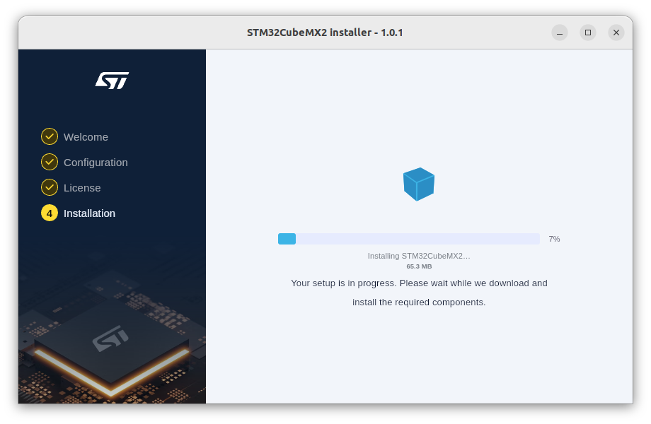

安装完毕后：


完成安装后，选择左下角的九个点：


可以从全部应用程序中打开STM32CubeMX2:


#### STM32CubeMX（不可用于C5系列）

首先，将下载的文件复制进虚拟机，并且将其解压：


解压之后，进入解压出来的文件夹，双击这个文件执行：

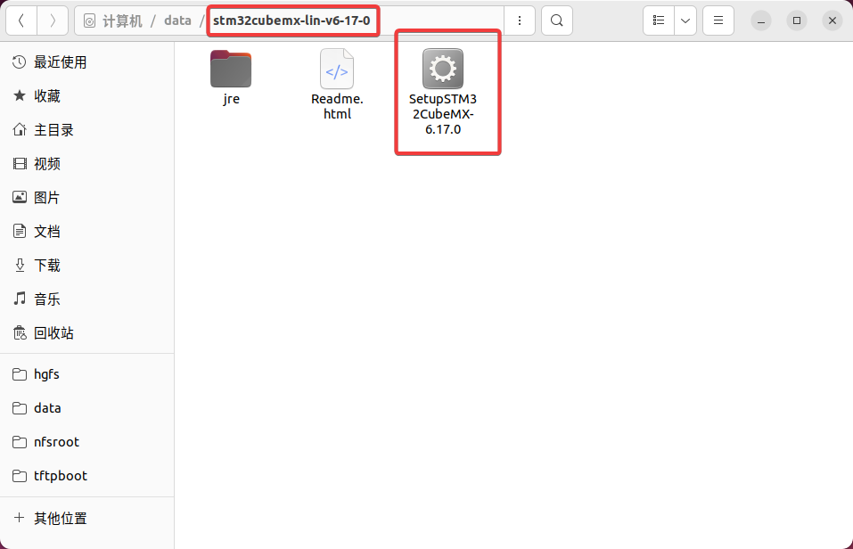

一路next就行，出现此界面就算安装完成：


继续next，然后done：


同样打开全部应用程序，就可以启动STM32CubeMX了：


#### VS Code

将下载的文件复制到虚拟机中：

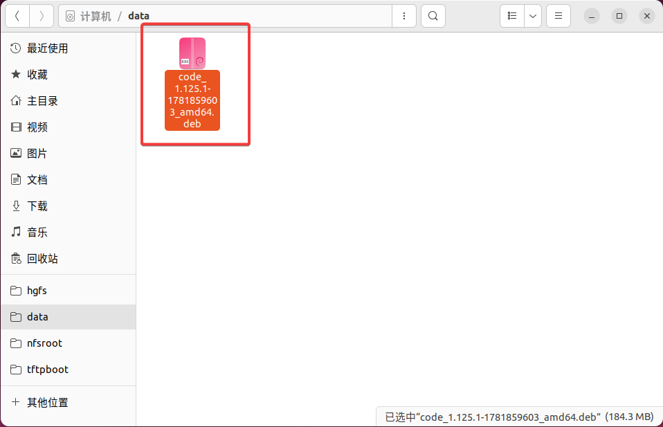

再此目录中打开终端，并且执行（因下载的版本不同，code-xxx.deb.替换为相应版本的文件即可）：

```Shell
sudo apt install ./code-xxx.deb
```

完成APT的安装之后，进入VS Code，安装如下几个插件（搜索名字的前几个单词即可）：

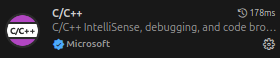

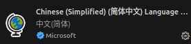


#### GCC

使用APT直接安装：

```Shell
sudo apt install gcc-arm-none-eabi
```

#### OpenOCD

使用APT直接安装：

```Shell
sudo apt install openocd
```

### 环境验证

在STM32CubeMX中，从MCU新建工程：

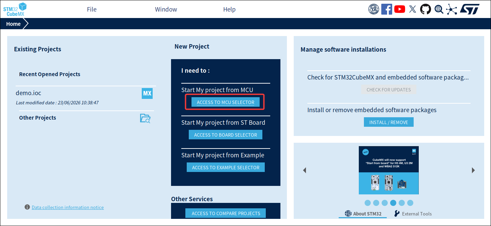

经过一番下载之后（如果有警告，直接忽略，看看最后能不能进入到MCU型号选择界面），进入到MCU信号选择界面。在红框处的输入框随便输入一个芯片的型号：

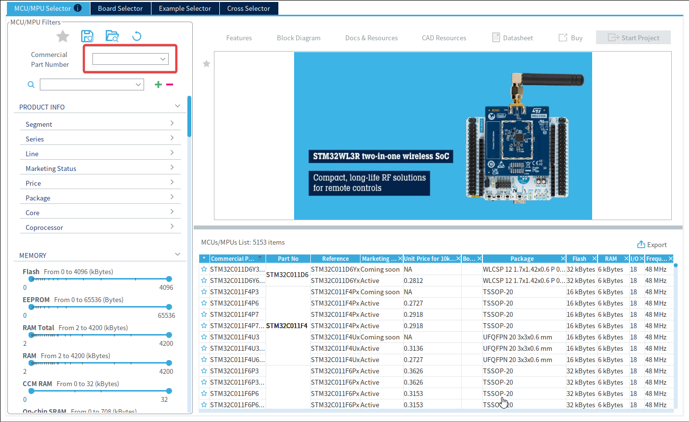

型号选择好之后，点击`Start Project`创建工程：

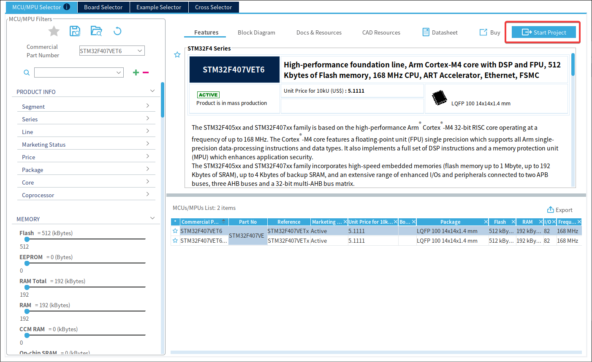

进入工程之后，进行红框处的修改：

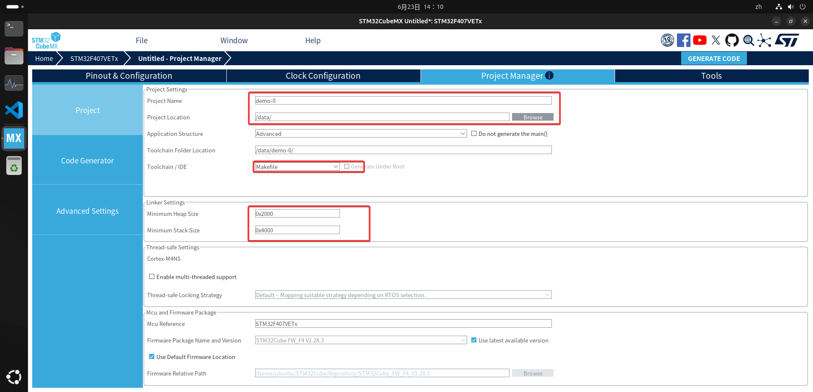

从上到下，这些修改分别对应于工程名称与路径、编译工具链方式（我们这里选择开源的Makefile工具链）和堆栈大小（扩大16倍以免堆栈溢出）。

完成以上修改之后，就可以创建工程代码了：

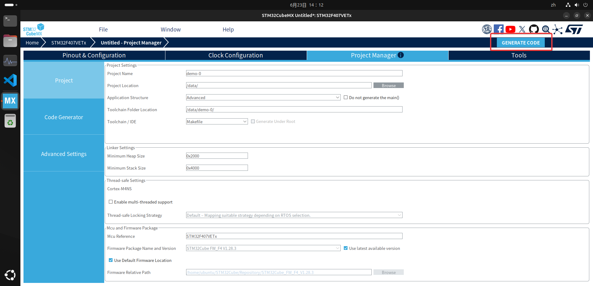

第一次创建工程代码的时候会要求登陆账号和下载固件包，这时候可以科学上网提升速度。

创建完毕后，我们直接打开文件夹：

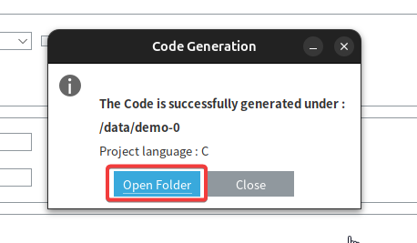

打开文件夹之后，我们可以退回到工程目录的父目录之中：

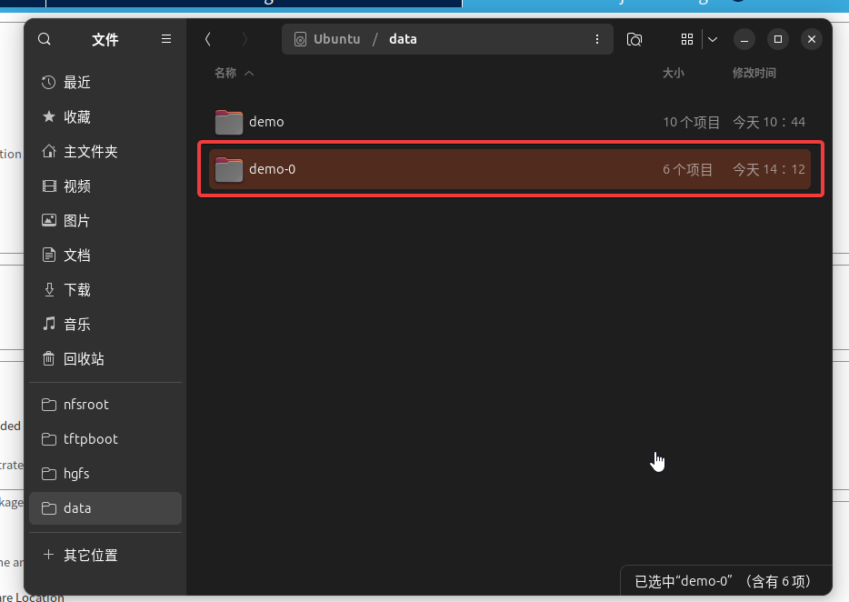

然后右键，选择打开方式：

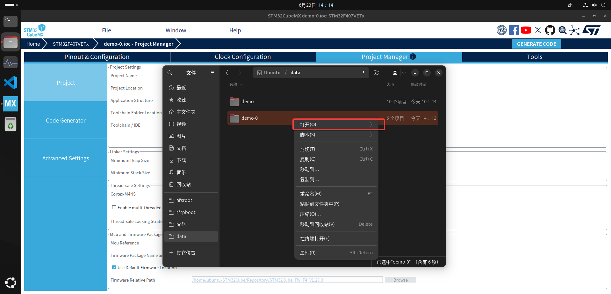

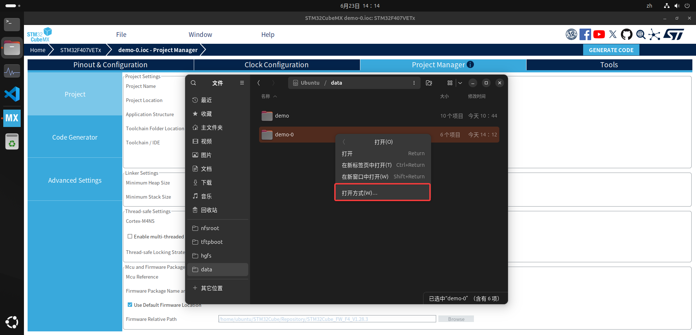

选择使用VS Code打开：

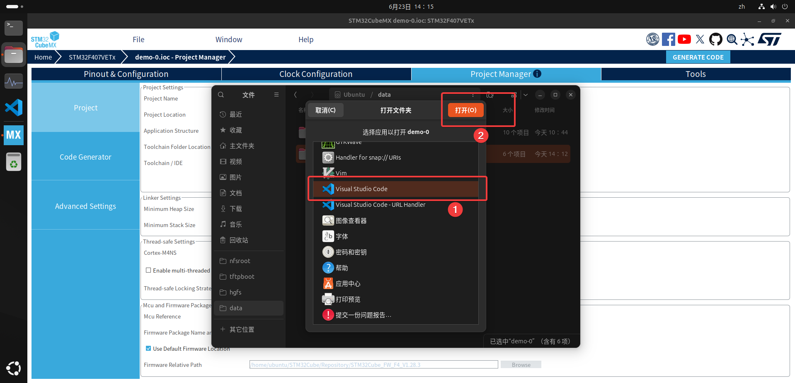

如果成功安装了各种插件，则会在左侧栏有一个这个图像：

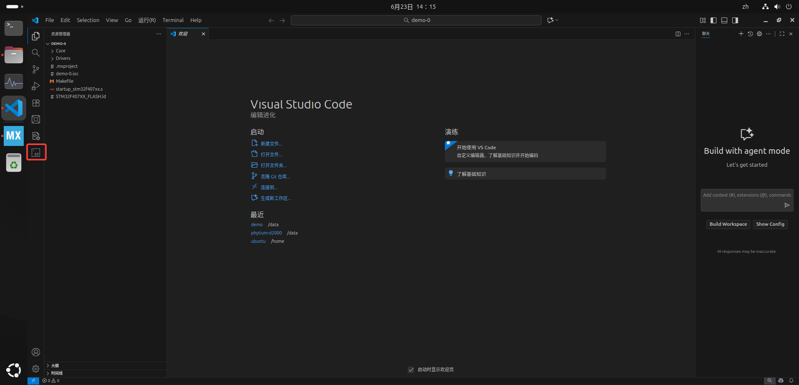

点击进入这个插件，并且点击`Build`，如果在终端中出现如下信息则代表编译环境已经安装成功了：

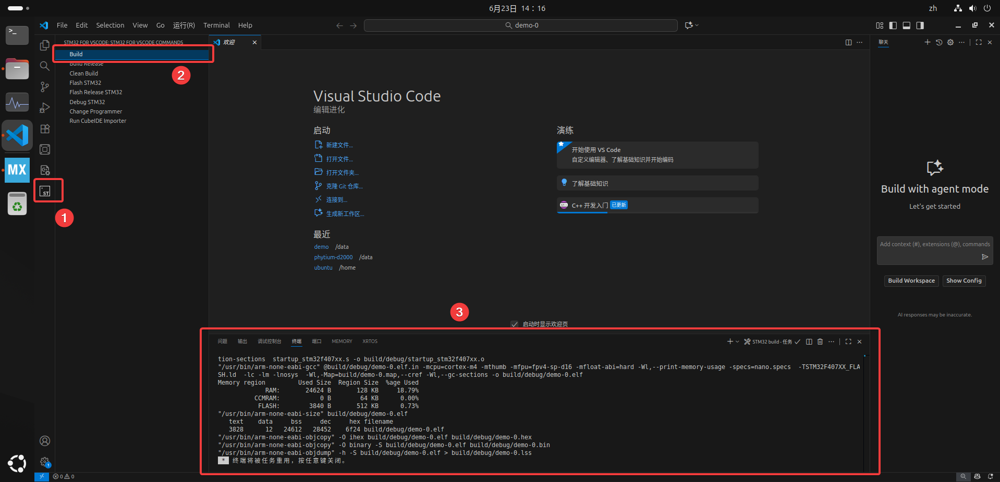
