# STM32开源工具链

- [STM32开源工具链](#stm32开源工具链)
  - [系统安装](#系统安装)
    - [VMware虚拟机](#vmware虚拟机)
    - [Ubuntu-24.04安装](#ubuntu-2404安装)
  - [环境部署](#环境部署)
    - [需要下载的工具](#需要下载的工具)
      - [STM32CubeMX2（仅用于C5系列）](#stm32cubemx2仅用于c5系列)
    - [STM32CubeMX（不可用于C5系列）](#stm32cubemx不可用于c5系列)
      - [VS Code](#vs-code)
    - [安装方法](#安装方法)
      - [STM32CubeMX2（仅用于C5系列）](#stm32cubemx2仅用于c5系列-1)
      - [STM32CubeMX（不可用于C5系列）](#stm32cubemx不可用于c5系列-1)
      - [VS Code](#vs-code-1)
      - [GCC](#gcc)


## 系统安装

### VMware虚拟机

需要安装Ubuntu-24.04虚拟机，VMware下载地址：

> https://www.vmware.com/products/desktop-hypervisor/workstation-and-fusion

VMware使用教程：

> https://zhuanlan.zhihu.com/p/110128514

### Ubuntu-24.04安装

Ubuntu-24.04下载地址：

> https://mirrors.ustc.edu.cn/

点击“获取安装镜像”：


选择Ubuntu-24.04.4,注意**一定要选择amd64架构的desktop版本**。

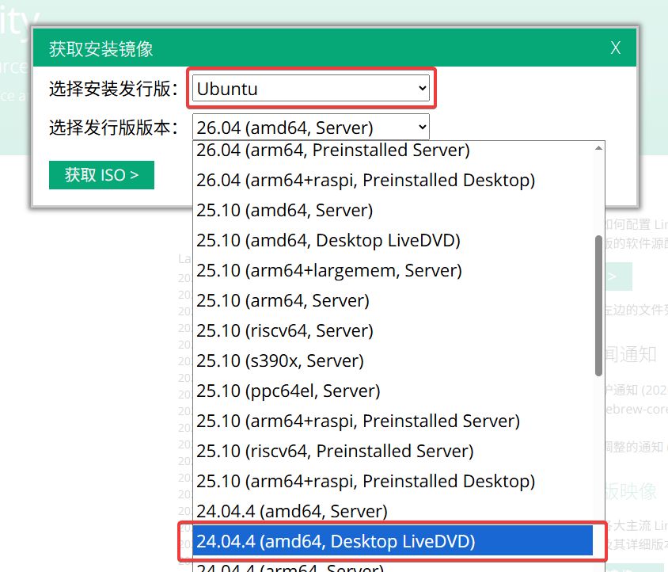

Ubuntu-24.04安装教程：

> https://zhuanlan.zhihu.com/p/695298037

Ubuntu-24.04的基本操作:

> https://zhuanlan.zhihu.com/p/672688377

Linux基础操作：

> https://www.runoob.com/linux/linux-tutorial.html

## 环境部署

### 需要下载的工具

#### STM32CubeMX2（仅用于C5系列）

> https://www.st.com/en/development-tools/stm32cubemx.html

使用ST账号登录后选择STM32CubeMX2：


### STM32CubeMX（不可用于C5系列）

> https://www.st.com/en/development-tools/stm32cubemx.html

使用ST账号登录后选择STM32CubeMX：

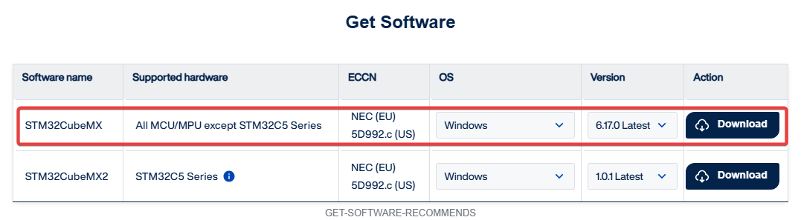

选择Linux版本：

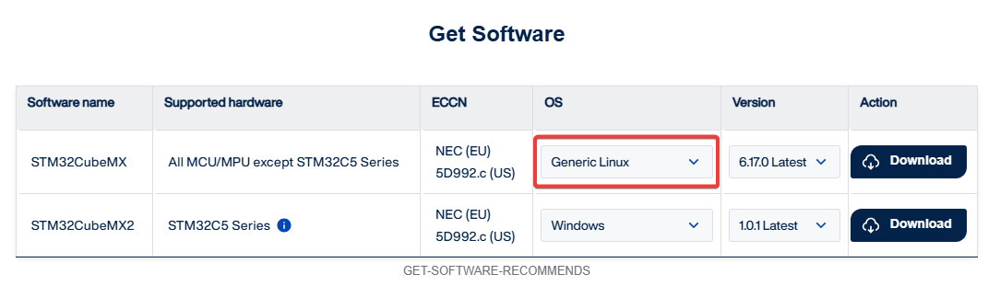

#### VS Code

> https://code.visualstudio.com/Download?_exp_download=fb315fc982

选择deb下载：


### 安装方法

#### STM32CubeMX2（仅用于C5系列）

首先安装基础库：

```Shell
sudo apt update
sudo apt install libwebkit2gtk-4.1-0
```

然后执行下载的文件：

```Shell
sudo ./stm32cubemx2-1.0.1-X64-Linux-installer
```

依次如下选择（全部保持默认选项即可）：

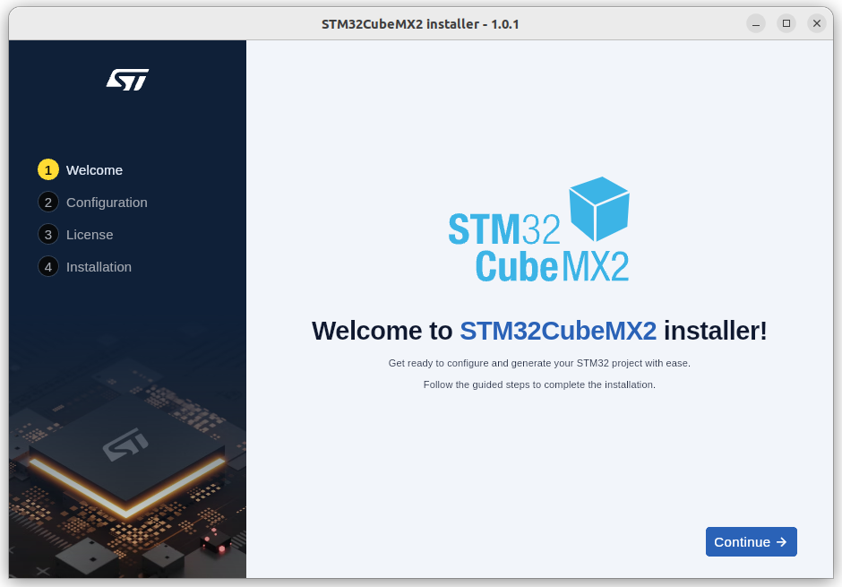

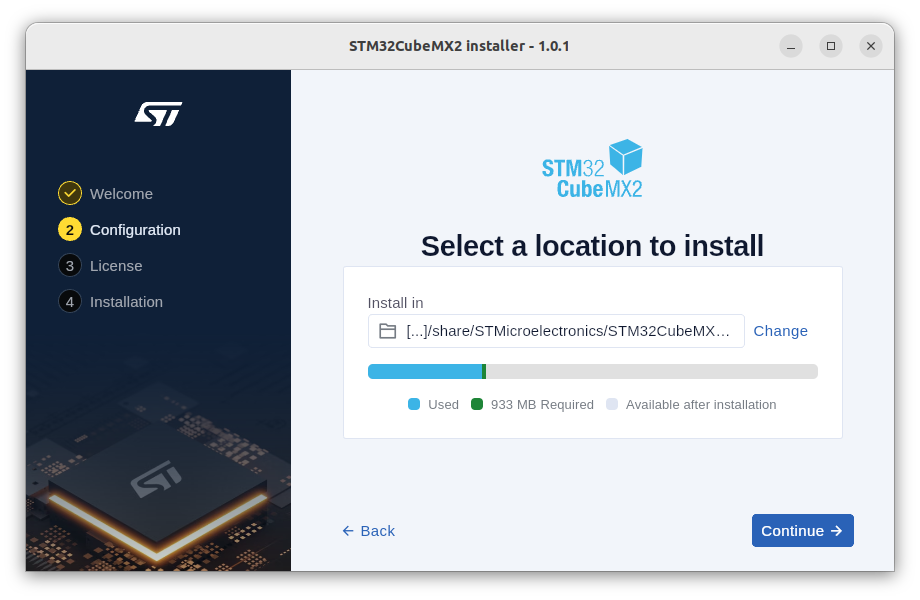

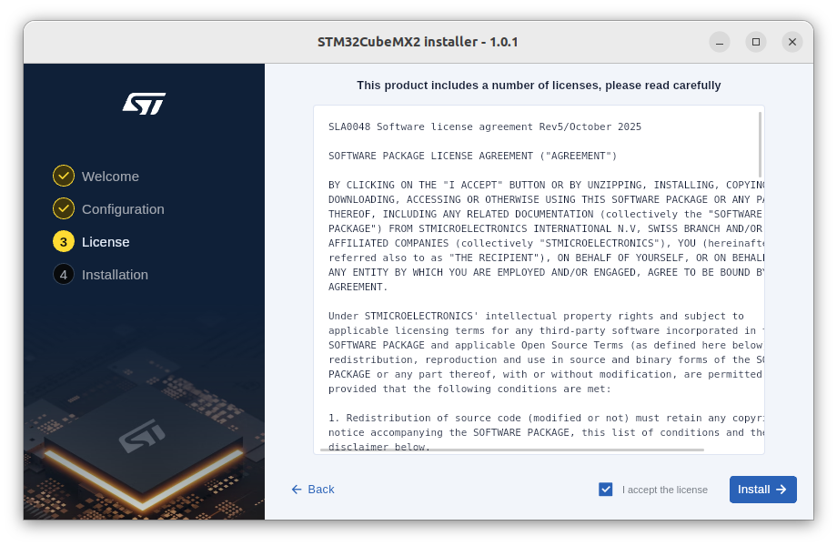


安装完毕后：

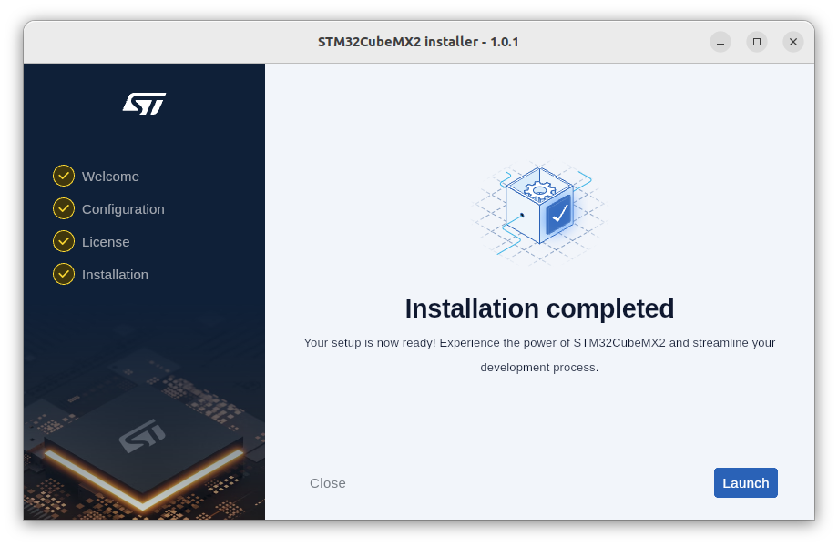

完成安装后，选择左下角的九个点：

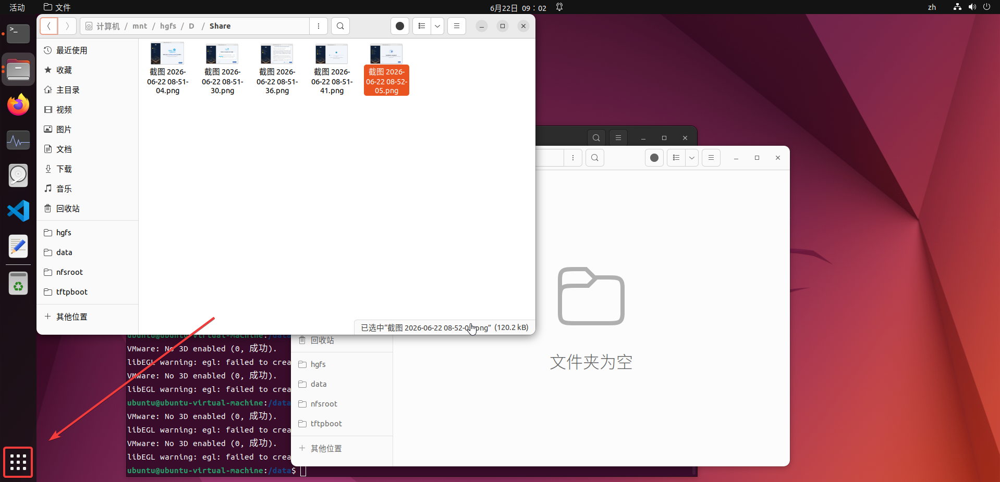

可以从全部应用程序中打开STM32CubeMX2:

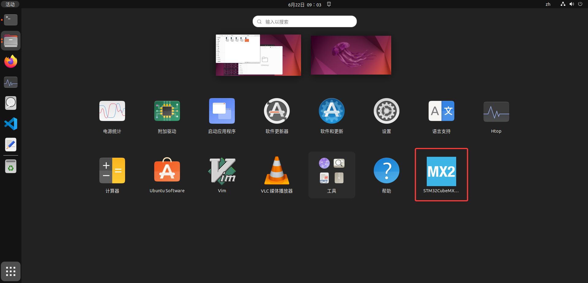

#### STM32CubeMX（不可用于C5系列）

首先，将下载的文件复制进虚拟机，并且将其解压：

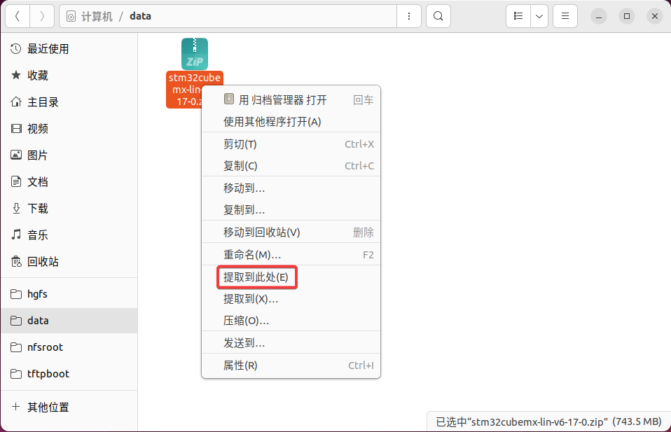

解压之后，进入解压出来的文件夹，双击这个文件执行：


一路next就行，出现此界面就算安装完成：

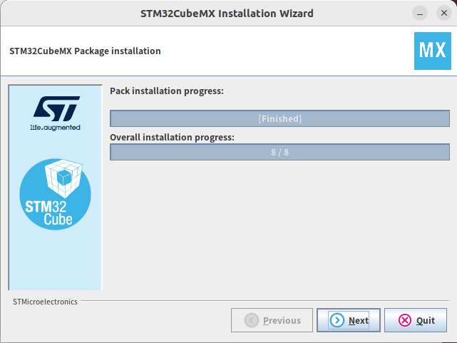

继续next，然后done：

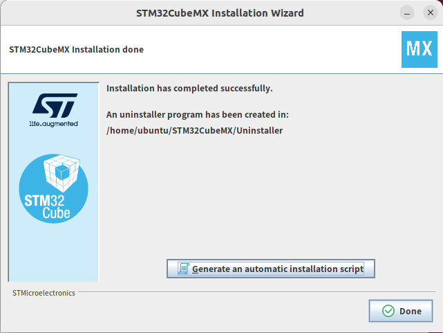

同样打开全部应用程序，就可以启动STM32CubeMX了：

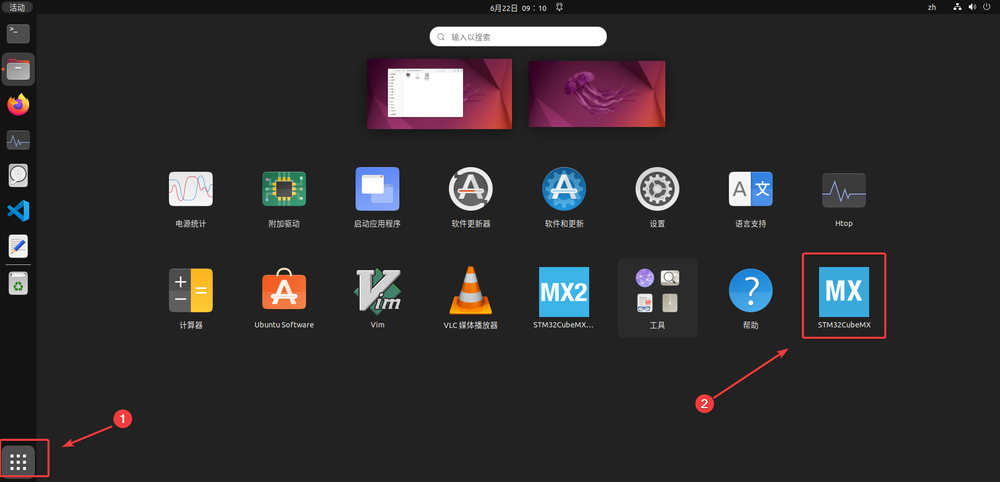

#### VS Code

将下载的文件复制到虚拟机中：


再此目录中打开终端，并且执行（因下载的版本不同，code-xxx.deb.替换为相应版本的文件即可）：

```Shell
sudo apt install ./code-xxx.deb
```

#### GCC

使用APT直接安装：

```Shell
sudo apt install gcc-arm-none-eabi
```
