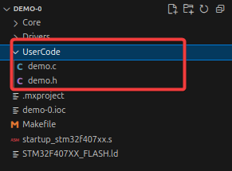
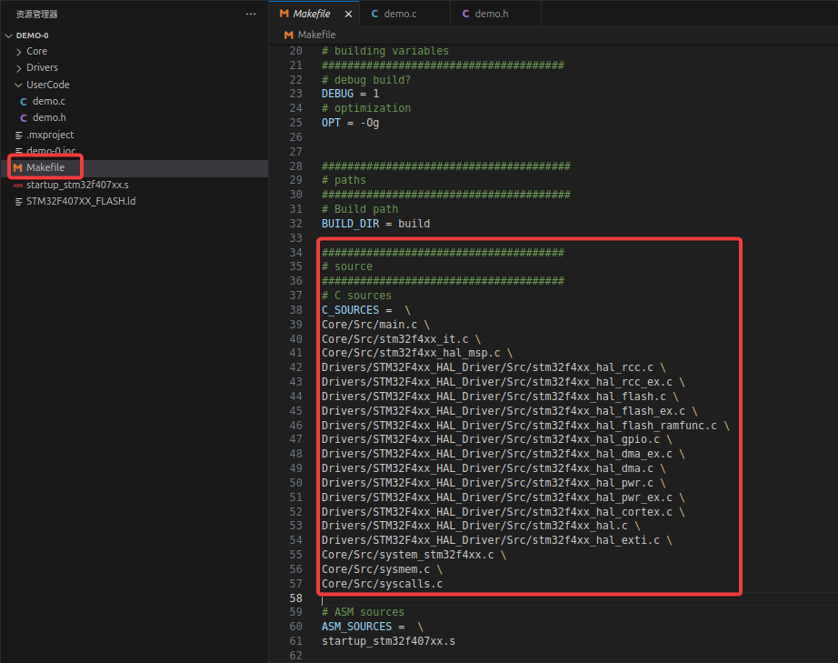
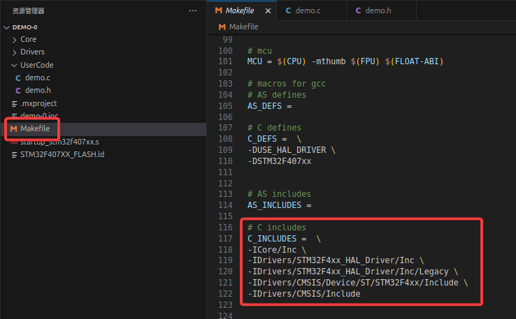

# 基于Makefile的使用技巧

- [基于Makefile的使用技巧](#基于makefile的使用技巧)
  - [Makefile相关使用](#makefile相关使用)
    - [添加私有代码文件](#添加私有代码文件)
    - [F4系列添加CMSIS算法加速库](#f4系列添加cmsis算法加速库)
    - [H7系列添加CMSIS算法加速库](#h7系列添加cmsis算法加速库)
  - [代码相关内容](#代码相关内容)
    - [重定向`printf()`函数](#重定向printf函数)

## Makefile相关使用

### 添加私有代码文件

为了演示，我新建了两个文件，分别为`UserCode/demo.h`和`UserCode/demo.c`，对应于头文件和源文件：



首先要找到`Makefile`中的`C_SOURCES`变量，类似于以下内容：



然后添加自己的源文件，添加后内容如下：

```Makefile
######################################
# source
######################################
# C sources
C_SOURCES =  \
Core/Src/main.c \
Core/Src/stm32f4xx_it.c \
Core/Src/stm32f4xx_hal_msp.c \
Drivers/STM32F4xx_HAL_Driver/Src/stm32f4xx_hal_rcc.c \
Drivers/STM32F4xx_HAL_Driver/Src/stm32f4xx_hal_rcc_ex.c \
Drivers/STM32F4xx_HAL_Driver/Src/stm32f4xx_hal_flash.c \
Drivers/STM32F4xx_HAL_Driver/Src/stm32f4xx_hal_flash_ex.c \
Drivers/STM32F4xx_HAL_Driver/Src/stm32f4xx_hal_flash_ramfunc.c \
Drivers/STM32F4xx_HAL_Driver/Src/stm32f4xx_hal_gpio.c \
Drivers/STM32F4xx_HAL_Driver/Src/stm32f4xx_hal_dma_ex.c \
Drivers/STM32F4xx_HAL_Driver/Src/stm32f4xx_hal_dma.c \
Drivers/STM32F4xx_HAL_Driver/Src/stm32f4xx_hal_pwr.c \
Drivers/STM32F4xx_HAL_Driver/Src/stm32f4xx_hal_pwr_ex.c \
Drivers/STM32F4xx_HAL_Driver/Src/stm32f4xx_hal_cortex.c \
Drivers/STM32F4xx_HAL_Driver/Src/stm32f4xx_hal.c \
Drivers/STM32F4xx_HAL_Driver/Src/stm32f4xx_hal_exti.c \
Core/Src/system_stm32f4xx.c \
Core/Src/sysmem.c \
Core/Src/syscalls.c  \
UserCode/demo.c
```

然后再找到`C_INCLUDES`变量，类似如下内容：



然后添加自己的头文件路径（注意这里是添加路径，不是添加文件），添加后内容如下：

```Makefile
# C includes
C_INCLUDES =  \
-ICore/Inc \
-IDrivers/STM32F4xx_HAL_Driver/Inc \
-IDrivers/STM32F4xx_HAL_Driver/Inc/Legacy \
-IDrivers/CMSIS/Device/ST/STM32F4xx/Include \
-IDrivers/CMSIS/Include \
-IUserCode
```

保存`Makefile`文件的更改，再次编译即可。

### F4系列添加CMSIS算法加速库

在`C_INCLUDES`中添加`-IDrivers/CMSIS/DSP/Include`。

### H7系列添加CMSIS算法加速库

在`C_INCLUDES`中添加`-IDrivers/CMSIS/DSP/Include`。

在`LIBS`（这个变量在文件靠后的位置）中添加`-larm_cortexM7lfdp_math`。

在`LIBDIR`（这个变量就在`LIBS`的下一行）中添加`-LDrivers/CMSIS/DSP/Lib/GCC`。

添加完之后大概是这样的，可能会有一些不一样（例如`-specs=nano.specs`可能已经被删除），但是基本都是一样的：

```Makefile
# libraries
LIBS = -lc -lm -lnosys -larm_cortexM7lfdp_math
LIBDIR = -LDrivers/CMSIS/DSP/Lib/GCC
LDFLAGS = $(MCU) -specs=nano.specs -T$(LDSCRIPT) $(LIBDIR) $(LIBS) -Wl,-Map=$(BUILD_DIR)/$(TARGET).map,--cref -Wl,--gc-sections
```

## 代码相关内容

### 重定向`printf()`函数

如果需要使用`printf()`函数进行调试信息输出，则比如按照此步骤重定向`printf()`函数到UART口进行输出。

首先，在`main.c`的开头添加标准输入输出库：

```C
#include <stdio.h>
```

然后在一个可以填写代码的地方（不要写在主函数内），添加如下内容：

```C
#ifdef __GNUC__
/* With GCC, small printf (option LD Linker->Libraries->Small printf set to 'Yes') calls __io_putchar() */
int __io_putchar(int ch)
{
    /* 发送数据：huart1 为你的串口句柄，最后一个参数为超时时间（毫秒） */
    HAL_UART_Transmit(&huart1, (uint8_t *)&ch, 1, 0xFFFF);
    return ch;
}
#else
int fputc(int ch, FILE *f)
{
    HAL_UART_Transmit(&huart1, (uint8_t *)&ch, 1, 0xFFFF);
    return ch;
}
#endif /* __GNUC__ */
```

需要注意的是，此处需要将`huart1`替换为你的UART串口在HAL库代码中的句柄变量名。

最好不要用这个`printf()`函数进行浮点数打印。
