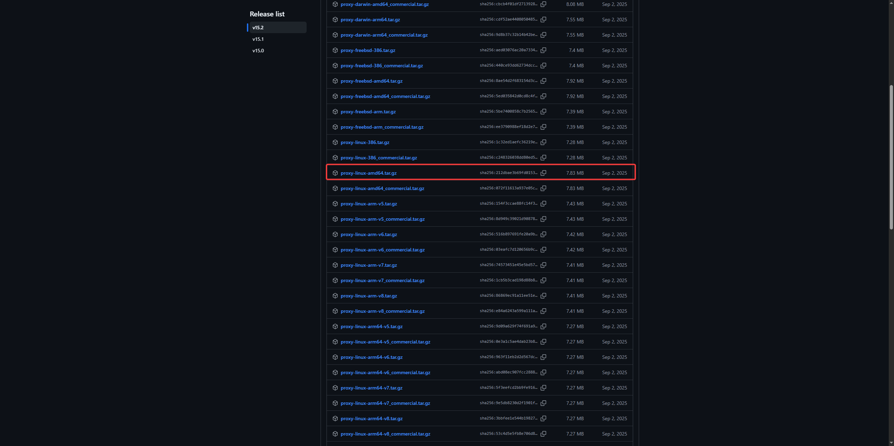

# 中转服务器部署

- [中转服务器部署](#中转服务器部署)
  - [文件准备](#文件准备)
  - [安装过程](#安装过程)
  - [服务部署](#服务部署)
  - [附录](#附录)

## 文件准备

> [!WARNING]
> 在某些情况下，`wget`指令可能无法顺利执行，这时候请在浏览器或者在本地的Linux系统上预先下载好文件，再通过SFTP等方式上传到服务器上

下载[可执行文件][1]（注意看清楚指令集和系统类型，AMD64的别下成了ARM64，其他指令集和系统自行寻找）：



然后获取安装脚本（如果无法`wget`，就自己想办法下载下来传到服务器上）：

```Shell
wget https://mirrors.goproxyauth.com/https://raw.githubusercontent.com/snail007/goproxy/master/install.sh
```

## 安装过程

将获得的`install.sh`和`proxy-linux-amd64.tar.gz`文件放在主目录下，然后执行：

```Shell
chmod +x ./install.sh
sudo ./install.sh
```

出现以下信息则表明安装完成：

```Shell
ubuntu@ip-172-31-27-33:~$ sudo ./install.sh 
>>> installing ... 

>>> install done, thanks for using snail007/goproxy free_15.2

>>> install path /usr/bin/proxy

>>> configuration path /etc/proxy

>>> uninstall just exec : rm /usr/bin/proxy && rm -rf /etc/proxy

>>> How to using? Please visit : https://snail007.host900.com/goproxy/manual/

```

## 服务部署

编辑文件`/lib/systemd/system/goproxy.service`：

```Shell
sudo vim /lib/systemd/system/goproxy.service
```

填入内容：

```txt
[Unit]
Description=Goproxy Server
After=network.target

[Service]
Type=simple
WorkingDirectory=/etc/proxy
ExecStart=/usr/bin/proxy http -t tcp -p :7890
Restart=on-failure
RestartSec=5s

[Install]
WantedBy=multi-user.target
```

启动服务：

```Shell
sudo systemctl daemon-reload
sudo systemctl enable --now goproxy
sudo systemctl status goproxy
```

出现以下内容则代表状态正常：

```Shell
● goproxy.service - Goproxy Server
     Loaded: loaded (/usr/lib/systemd/system/goproxy.service; enabled; preset: enabled)
     Active: active (running) since Mon 2026-07-20 07:25:41 UTC; 1s ago
 Invocation: 3c067c5ca25b4714aea49040ca638cd3
   Main PID: 12119 (proxy)
      Tasks: 8 (limit: 627)
     Memory: 21.7M (peak: 21.7M)
        CPU: 133ms
     CGroup: /system.slice/goproxy.service
             └─12119 /usr/bin/proxy http -t tcp -p :7890

Jul 20 07:25:41 ip-172-31-27-33 systemd[1]: Started goproxy.service - Goproxy Server.
Jul 20 07:25:41 ip-172-31-27-33 proxy[12119]: 2026/07/20 07:25:41.143 INFO tcp http(s) proxy on [::]:7890
Jul 20 07:25:41 ip-172-31-27-33 proxy[12119]: 2026/07/20 07:25:41.143 INFO your system ulimit 524288 is too small, max value is: 524288, try set to 1000000
Jul 20 07:25:41 ip-172-31-27-33 proxy[12119]: 2026/07/20 07:25:41.143 INFO the result ulimit is: 1000000
```

## 附录

[1]: https://docs.gitea.com/zh-cn/1.19/installation/install-from-source